# Database Design

Ten tables. Three principles govern the schema:

1. **Append-only money trail** — `salary_changes` and `salary_credits` are never updated or deleted; corrections are new rows.
2. **The database is the referee** — invariants live in constraints (unique keys), not just application code.
3. **Indexes are chosen per query path**, and named below with the query they serve.

```mermaid
erDiagram
    EMPLOYEES {
        bigint id PK
        varchar employee_code UK
        varchar name
        varchar email
        varchar country
        varchar department
        varchar currency_code FK
        decimal annual_salary
        enum status "ACTIVE | ON_HOLD"
        date joined_on
        boolean deleted "soft delete"
        int version "optimistic lock"
    }
    SALARY_CHANGES {
        bigint id PK
        bigint employee_id FK
        decimal old_salary
        decimal new_salary
        enum change_type "PERCENT | AMOUNT | CORRECTION"
        decimal percent_value "null for AMOUNT"
        varchar actor
        bigint bulk_raise_run_id FK "null if individual"
        datetime created_at
    }
    SALARY_CREDITS {
        bigint id PK
        bigint employee_id FK "UQ(emp,year,month)"
        smallint year "UQ part - idempotency"
        tinyint month "UQ part - idempotency"
        decimal amount
        varchar currency_code
        decimal usd_rate "snapshot at credit time"
        bigint payroll_run_id FK
        datetime created_at
    }
    PAYROLL_RUNS {
        bigint id PK
        smallint year
        tinyint month
        int processed_count
        int skipped_held_count
        int already_processed_count
        varchar initiated_by
        datetime created_at
    }
    BULK_RAISE_RUNS {
        bigint id PK
        enum raise_type "PERCENT | AMOUNT"
        decimal raise_value
        varchar filter_country "nullable"
        varchar filter_department "nullable"
        int applied_count
        int review_count
        int excluded_count
        enum status "QUEUED | RUNNING | COMPLETED - job state"
        json excluded_ids "persisted for crash resume"
        varchar initiated_by
        datetime created_at
    }
    RAISE_REVIEW_ITEMS {
        bigint id PK
        bigint employee_id FK
        bigint bulk_raise_run_id FK "null if individual"
        decimal proposed_old
        decimal proposed_new
        varchar reason
        enum status "PENDING | APPROVED | REJECTED"
        datetime resolved_at "nullable"
        datetime created_at
    }
    CURRENCY_RATES {
        varchar code PK
        varchar name
        decimal usd_rate "manually managed"
        datetime updated_at
    }
    ORG_SETTINGS {
        bigint id PK "single row"
        decimal raise_threshold_percent "default 30"
    }
    HR_USERS {
        bigint id PK
        varchar username UK
        varchar password_hash
        varchar name
    }
    AUDIT_LOG {
        bigint id PK
        varchar entity_type
        bigint entity_id
        varchar action
        varchar actor
        json changed_fields "nullable"
        varchar ref_table "thin reference, nullable"
        bigint ref_id
        bigint run_id "nullable - collapse key"
        datetime created_at "keyset cursor"
    }

    EMPLOYEES ||--o{ SALARY_CHANGES : "has history of"
    EMPLOYEES ||--o{ SALARY_CREDITS : "is paid via"
    EMPLOYEES ||--o{ RAISE_REVIEW_ITEMS : "may be parked in"
    EMPLOYEES }o--|| CURRENCY_RATES : "paid in"
    PAYROLL_RUNS ||--o{ SALARY_CREDITS : "creates"
    BULK_RAISE_RUNS ||--o{ SALARY_CHANGES : "generates"
    BULK_RAISE_RUNS ||--o{ RAISE_REVIEW_ITEMS : "parks"
```

## Constraints that carry design weight

| Constraint | Where | Why |
|---|---|---|
| `UNIQUE (employee_id, year, month)` | `salary_credits` | **Payroll idempotency** — double-processing is structurally impossible; the DB is the referee |
| `UNIQUE (employee_code)` | `employees` | Business identifier, import-safe |
| `version` column | `employees` | Optimistic locking — concurrent bulk + individual edits can't silently overwrite |
| `deleted` flag (soft delete) | `employees` | Payroll history must survive employee removal |
| No `UPDATE` path in code | `salary_changes`, `salary_credits`, `audit_log` | Append-only ledger discipline |

## Index plan (per query path)

| Index | Serves |
|---|---|
| `employees (deleted, country, department)` | directory filters |
| `employees (deleted, name)` | directory search |
| `salary_changes (employee_id, created_at DESC)` | change-history panel |
| `salary_credits (employee_id, year DESC, month DESC)` | credit-history panel (the unique key also serves lookups) |
| `audit_log (entity_type, entity_id, created_at DESC)` | per-employee activity panel |
| `audit_log (created_at DESC, id DESC)` | global feed — **keyset pagination** walks this index; constant-time at any depth |
| `audit_log (run_id)` | run drill-down (expand a collapsed bulk run) |

Rarer filter combinations on the audit feed ride the `created_at` index and scan the narrowed range — acceptable because filtered sets are small; indexing every combination is deliberately avoided.

## Notes

- Money columns: `DECIMAL(15,2)`; FX rates: `DECIMAL(12,6)`. Never floats.
- Enum-valued columns ship as `VARCHAR` + `CHECK` constraints (not MySQL `ENUM`) so the identical Flyway migration runs on both MySQL and the H2 test slice; the invariant is the same.
- All `DATETIME` values are UTC: the JDBC layer is pinned with `hibernate.jdbc.time_zone: UTC`, and application code stamps timestamps in UTC. Keyset cursors and the seeded history rely on this single convention.
- **Rate convention:** `usd_rate` = units of local currency per 1 USD (e.g., 90.00 INR/USD). USD values are derived at read time as `amount / usd_rate` — from the row's own snapshot for history, from current `currency_rates` for projections. The snapshot is captured by copying the live rate into the credit row at insert; credits never join back to `currency_rates`.
- `audit_log.changed_fields` is JSON (`old → new` per field) for profile edits; **salary events store no amounts here** — they are thin references (`ref_table`, `ref_id`) to the owning row. Complete trail, zero duplication.
- `run_id` on `audit_log` is the collapse key: the global UI groups bulk-generated rows under one header sourced from the run tables.
- At production scale: monthly partitioning of `audit_log` + archival policy (documented, deliberately not built).
- **Bulk raise runs are durable jobs (V2):** `status` drives an outbox-style poller; which employees are already processed is *derived* from `salary_changes`/`raise_review_items` tagged with the run id — the append-only ledger doubles as the job's progress record, so no per-item work table exists and crash-resume never double-applies.
